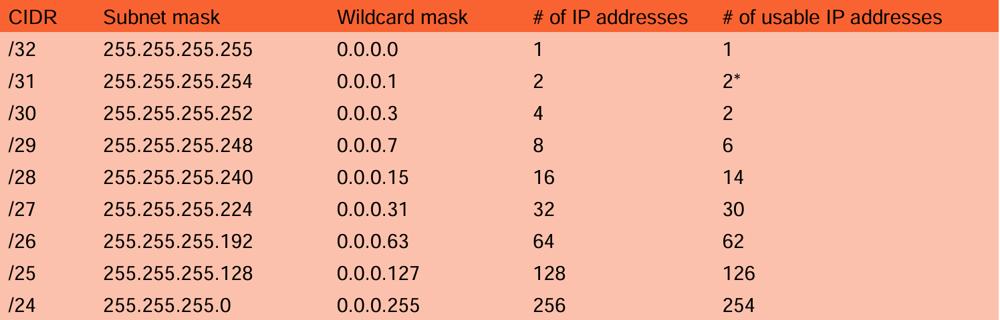

# Examen Januarie Computer Networking
# Network Models and Devices

## **Netwerkmodellen**

Netwerkmodellen beschrijven hoe gegevens worden uitgewisseld tussen apparaten in een netwerk. Ze maken gebruik van gelaagde structuren waarin elke laag specifieke functies heeft. Deze lagen bieden abstractie en modulariteit, zodat hogere lagen zich niet hoeven bezig te houden met hoe gegevens worden doorgestuurd.

### **Belangrijke modellen:**
1. **OSI/ISO 7-layer model**:
   - Ontwikkeld door de International Standards Organization (ISO).
   - Generiek model met zeven lagen:
     1. **Fysiek (Physical)**: Hardware, elektrische signalen, fysieke verbindingen.
     2. **Datakoppeling (Datalink)**: Foutdetectie, framing, MAC-adressen.
     3. **Netwerk (Network)**: Routering, adressering (bijvoorbeeld IP).
     4. **Transport**: End-to-end communicatie tussen applicaties, betrouwbaarheid.
     5. **Sessie (Session)**: Beheer van sessies en verbindingen.
     6. **Presentatie (Presentation)**: Vertaling van gegevens naar leesbare formaten.
     7. **Applicatie (Application)**: Toegang tot netwerkdiensten, zoals web of e-mail.

   - De lagen zijn genummerd van 1 (laagste) tot 7 (hoogste).

2. **TCP/IP 5-layer model**:
   - Simpeler en specifiek gericht op het internetprotocol.
   - Heeft vijf lagen: **Physical**, **Data Link**, **Network**, **Transport**, **Application**.

---

## **Netwerkapparatuur**

Netwerkapparatuur speelt een cruciale rol bij communicatie tussen apparaten. Hieronder een overzicht van de belangrijkste apparaten:

1. **Repeater**:
   - Werkt op de fysieke laag (laag 1).
   - Versterkt verzwakte signalen om bereik te vergroten.
   - Kopieert signalen bit voor bit.

2. **Hub**:
   - Een multi-poort repeater, werkt op laag 1.
   - Verstuurt data naar alle aangesloten apparaten zonder filtering.
   - Inefficiënt: creëert één grote collision domain.

3. **Bridge**:
   - Werkt op de datalinklaag (laag 2).
   - Filtert data door MAC-adressen te lezen.
   - Verbindt LAN's die hetzelfde protocol gebruiken.
   - Vermindert verkeer door gerichte transmissie.

4. **Switch**:
   - Een geavanceerde multi-poort bridge.
   - Werkt op laag 2.
   - Voert foutcontrole uit en stuurt alleen correcte data naar de juiste poort.
   - Verkleint collision domains maar behoudt hetzelfde broadcast domain.

   **Types switches:**
   - **Onbeheerd (Unmanaged)**: Eenvoudig, plug-and-play.
   - **Beheerd (Managed)**: Ondersteunt VLAN's, QoS en geavanceerd beheer.
   - **Smart switches**: Tussen onbeheerd en beheerd, eenvoudigere configuratie.
   - **Layer 2 switches**: Werken op de datalinklaag.
   - **Layer 3 switches**: Werken op de netwerklaag, ondersteunen routering.
   - **PoE switches**: Leveren stroom via ethernetkabels.
   - **Gigabit switches**: Ondersteunen hogere snelheden.
   - **Rack-mounted switches**: Geschikt voor serverracks in datacenters.
   - **Desktop switches**: Compact, voor kleine kantoren.
   - **Modulaire switches**: Uitbreidbaar voor grotere netwerken.

5. **Router**:
   - Werkt op de netwerklaag (laag 3).
   - Routeert data tussen verschillende netwerken (bijvoorbeeld LAN naar WAN).
   - Maakt gebruik van dynamische routingtabellen.
   - Verdeelt broadcast domains.

6. **Gateway**:
   - Verbindt netwerken met verschillende protocollen.
   - Werkt op meerdere lagen.
   - Fungeert als protocolconverter en vertaalt gegevens tussen systemen.

7. **Brouter (Bridging Router)**:
   - Combineert functies van bridge en router.
   - Werkt op laag 2 (bridging) en laag 3 (routering).

8. **NIC (Network Interface Card)**:
   - Een netwerkadapter die een computer verbindt met het netwerk.
   - Werkt op de fysieke en datalinklaag.
   - Bevat een unieke identificatie (MAC-adres).


### Voorbeelden lagen
- Fysieke laag(1) => Kabels
- Datalinklaag(2) => MAC
- Netwerklaag (3) => IP
- Transportlaag (4) => Pakketen
- Sessielaag (5) => Videocall
- Presentatielaag (6) => IMG
- Applicatielaag (7) => HTTP
---


# Hoofdstuk 2 - Internet Protocol Suite

## **TCP/IP-Modellen**

### **Originele 4-lagenmodel**
1. **Applicatielaag (Application):**
   - Verantwoordelijk voor netwerkdiensten direct voor eindgebruikers (bijv. HTTP, SMTP, FTP).
2. **Transportlaag (Transport):**
   - Zorgt voor betrouwbare dataoverdracht via TCP of minder betrouwbare overdracht via UDP.
3. **Internetlaag (Internet):**
   - Adressering en routering van datapakketten via IP.
4. **Netwerkinterface-laag (Link/Network Access):**
   - Regelt de fysieke transmissie van data via de netwerkinterface.

### **Bijgewerkt 5-lagenmodel**
1. **Applicatielaag (Application):**
   - Diensten voor eindgebruikers.
2. **Transportlaag (Transport):**
   - Betrouwbare overdracht (TCP, UDP).
3. **Netwerklaag (Network):**
   - Adressering en routering.
4. **Datalinklaag (Data Link):**
   - Foutdetectie en framing.
5. **Fysieke laag (Physical):**
   - Fysieke transmissie van data.

## **Voordelen van TCP/IP**
1. **Universele adoptie:** Wereldwijde standaard voor internetcommunicatie.
2. **Schaalbaarheid en flexibiliteit:** Geschikt voor nieuwe protocollen en technologieën.
3. **Interoperabiliteit:** Zorgt voor compatibiliteit tussen verschillende apparaten en systemen.
4. **Standaardisatie:** Biedt een uniform raamwerk voor protocollen.

---

## **IP-Adressen**

### **Wat is een IP-adres?**
- Uniek identificatienummer voor apparaten in een netwerk.
- Bestaat uit een **Netwerk-ID** (gebied) en een **Host-ID** (specifiek apparaat).

### **IPv4**
- **Formaat:** 32-bits (4 octets).
- **Notatie:** `xxx.xxx.xxx.xxx` (bijv. `192.168.0.1`).
- **Beperkingen:** Biedt ~4 miljard unieke adressen.
- **Subnetmasker:** Voorbeeld: `255.255.255.0` (CIDR `/24`).

### **IPv6**
- **Formaat:** 128-bits (8 groepen van 16-bits in hexadecimaal).
- **Notatie:** `xxxx:xxxx:xxxx:xxxx:xxxx:xxxx:xxxx:xxxx`.
- **Voordelen:** 340 undeciljoen adressen, ontworpen om IPv4-beperkingen op te lossen.

---

## **Subnetten en CIDR**

### **Wat is subnetting?**
Subnetting verdeelt een netwerk in kleinere subnetwerken. Dit helpt bij beter gebruik van IP-adressen en verhoogt de veiligheid.

### **Subnetmaskers en CIDR-notatie**
- **Subnetmasker:** Duidt aan welk deel van een IP-adres het netwerk-ID en host-ID definieert.
  - Voorbeeld: `255.255.255.0` betekent dat de eerste 24 bits het netwerk-ID vormen.
- **CIDR-notatie:** Compacte representatie van subnetmaskers (bijv. `/24` voor `255.255.255.0`).

### **Subnetberekening**
- **Formule voor aantal hosts:** 2^(aantal hostbits) - 2.
  - Voorbeeld: Bij `/24` blijven 8 bits over voor hosts → 2^8 - 2 = 254 hosts.
- **Formule voor subnetten:** 2^(aantal subnetbits).
  - Voorbeeld: Als je 4 bits gebruikt voor subnetten → 2^4 = 16 subnetten.

---

## **IP-Klassen**

### **Overzicht van IP-klassen**
1. **Klasse A:**
   - Publieke IP-range: `1.0.0.0 - 127.255.255.255`.
   - Privé: `10.0.0.0 - 10.255.255.255`.
   - Maximaal aantal hosts: 2^24 - 2 = 16.777.214.

2. **Klasse B:**
   - Publieke IP-range: `128.0.0.0 - 191.255.255.255`.
   - Privé: `172.16.0.0 - 172.31.255.255`.
   - Maximaal aantal hosts: 2^16 - 2 = 65.534.

3. **Klasse C:**
   - Publieke IP-range: `192.0.0.0 - 223.255.255.255`.
   - Privé: `192.168.0.0 - 192.168.255.255`.
   - Maximaal aantal hosts: 2^8 - 2 = 254.

4. **Klasse D:** Multicast (geen hosts).
5. **Klasse E:** Gereserveerd voor onderzoek.

---

## **Voorbeelden van berekeningen**

### **Subnetmasker /24**
- **Subnetmasker:** `255.255.255.0`.
- **Aantal hosts:** 2^8 - 2 = 254.
- **Beschikbare IP-adressen:** `192.168.1.1 - 192.168.1.254`.

### **Subnetmasker /26**
- **Subnetmasker:** `255.255.255.192`.
- **Aantal hosts:** 2^6 - 2 = 62.
- **Beschikbare IP-adressen:** `192.168.1.1 - 192.168.1.62`.

### **IPv4 naar binair**
- **IP-adres:** `192.168.1.1`.
- **Binair:** `11000000.10101000.00000001.00000001`.

### **IPv6 voorbeeld**
- **Adres:** `2001:0db8:85a3:0000:0000:8a2e:0370:7334`.
- **Samengevoegd:** `2001:db8:85a3::8a2e:370:7334`.

---

---

## **Samenvatting**
De TCP/IP-suite is de ruggengraat van moderne netwerken. Subnetten en IP-adressering zijn essentieel voor netwerkbeheer. IPv6 biedt een oplossing voor de uitputting van IPv4-adressen en zorgt voor toekomstbestendigheid.


---

# Hoofdstuk 3 - Network Segmentation

## **Wat is netwerksegmentatie?**
Netwerksegmentatie is het proces waarbij een netwerk wordt onderverdeeld in kleinere, beter beheersbare domeinen, met beperkte communicatie tussen deze segmenten. Dit verhoogt zowel de veiligheid als het beheer binnen netwerken en cloudomgevingen. Elk segment kan specifieke beveiligingsregels en beleidsmaatregelen krijgen, afhankelijk van de behoeften van een organisatie. 

Bijvoorbeeld, een onderneming kan afzonderlijke segmenten maken voor HR, financiën, IT, marketing, en productie. Ook cloudgebaseerde omgevingen en SaaS-applicaties profiteren van segmentatie.

---

## **Voordelen van Netwerksegmentatie**
1. **Beperking van het aanvalsoppervlak:**
   - Door het netwerk te segmenteren, wordt de schade beperkt die een cyberaanvaller kan veroorzaken. Dit voorkomt laterale bewegingen van bedreigingen binnen een netwerk.
2. **Geavanceerde monitoring en detectie:**
   - Systemen kunnen waarschuwingen geven bij ongeautoriseerde toegangspogingen en verdachte activiteiten detecteren.
3. **Naleving van regelgeving:**
   - Bij audits, zoals voor de Payment Card Industry Data Security Standard (PCI DSS), kan de focus worden beperkt tot segmenten die kaartgegevens opslaan of verwerken.
4. **Beheersbaarheid:**
   - Netwerkbeheer wordt overzichtelijker doordat specifieke regels op afzonderlijke segmenten worden toegepast.

---

## **Netwerksegmentatie versus Microsegmentatie**
- **Netwerksegmentatie:** Verdeelt een netwerk in grotere secties en past algemene beveiligingsregels toe, zoals VLANs en firewalls.
- **Microsegmentatie:** Gaat verder door beveiligingsregels toe te passen op individuele workloads of virtuele machines. Het biedt meer granulariteit en is vaak gebaseerd op software-defined technologieën.

---

## **Netwerksegmentatie als Kern van Multi-Layer Defense**
Netwerksegmentatie vormt een belangrijk onderdeel van "defense-in-depth" strategieën. Door segmentatie wordt het voor aanvallers moeilijker om door te dringen. Het voorkomt of vertraagt onder andere:
- **SQL-injecties:** Aanvallen gericht op databases.
- **Compromitteren van werkstations:** Vooral apparaten met verhoogde rechten.
- **Aanvallen op perimeter servers:** Servers die extern toegankelijk zijn.
- **Misbruik van interne diensten:** Bijvoorbeeld LDAP of DNS.

Segmentatie voorkomt niet alleen aanvallen, maar biedt ook de mogelijkheid om schade te beperken als een aanval succesvol is.

---

## **Best Practices voor Netwerksegmentatie**

1. **Beveiligingsbeleid en bronnen identificeren:**
   - Ontwikkel beveiligingsbeleid voor elk type data en bron.
   - Identificeer welke gebruikers en systemen toegang nodig hebben, en definieer het toegangsmodel (bijv. lezen, schrijven).

2. **Gebruik Allowlist Access Control Lists (ACLs):**
   - Sta uitsluitend specifiek toegestane datastromen toe.
   - Identificeer en documenteer de datastromen van elke applicatie.
   - Hoewel dit tijdrovend kan zijn, voorkomt het dure beveiligingsincidenten.

3. **Fysieke en logische scheiding:**
   - **Fysieke scheiding:** Gebruik aparte firewalls of gescheiden hardware om netwerkcomplexiteit te verminderen.
   - **Logische scheiding:** Maak gebruik van VLANs, ACLs, en Virtual Routing and Forwarding (VRF) om netwerken logisch te scheiden.

4. **Software-defined Access (SD-Access):**
   - Gebruik SD-Access om endpoints te identificeren en ze aan specifieke segmenten toe te wijzen, ongeacht hun fysieke locatie.
   - Datastromen worden getagd, waardoor beveiligingsregels consistent kunnen worden toegepast.

5. **Automatisering:**
   - Automatiseer zoveel mogelijk stappen, zoals beveiligingsaudits, om consistentie te waarborgen en menselijke fouten te verminderen.
   - Gebruik tools die gebaseerd zijn op software-defined technologieën.

---

## **Hoe werkt Netwerksegmentatie?**

1. **Volledige blokkering:**
   - Het meest restrictieve beleid blokkeert alle communicatie tussen segmenten, bijvoorbeeld om te voldoen aan PCI DSS-regels. Dit voorkomt dat bedreigingen zich kunnen verspreiden.

2. **Selectieve filtering:**
   - Beperk welke soorten verkeer tussen zones mogen plaatsvinden, zoals DNS- of NTP-verkeer toestaan, maar alle andere typen blokkeren.
   - Filters kunnen gebaseerd zijn op IP-adressen, poorten, bron-applicaties, etc.

3. **Inspectie op applicatieniveau:**
   - Moderne netwerken vereisen granulariteit op applicatieniveau. Door next-gen firewalls te gebruiken, kunnen netwerkbeheerders datastromen inspecteren en toestaan of blokkeren op basis van gebruikersidentiteit, apparaatstatus en andere contextuele factoren.

---

## **Toepassingstechnologieën**
1. **Firewalls:** Voor fysieke en logische scheiding van segmenten.
2. **VLANs:** Virtuele netwerken creëren binnen een fysieke infrastructuur.
3. **VRF (Virtual Routing and Forwarding):** Logische scheiding van routinginformatie voor verschillende segmenten.
4. **SD-Access:** Voor consistent beleid ongeacht fysieke locatie.
5. **Automatisering:** Tools zoals software-defined technologieën voor consistentie en efficiëntie.

---

## **Samenvatting**
Netwerksegmentatie is een cruciaal mechanisme in moderne netwerkbeveiliging. Het beschermt gevoelige gegevens, voorkomt verspreiding van bedreigingen en verhoogt naleving van regelgeving. Door best practices zoals ACL’s, SD-Access en automatisering te implementeren, kunnen organisaties een robuust en schaalbaar beveiligingsmodel creëren.

---


# Hoofdstuk 4 - **Network Protocols**

## **Wat is een netwerkprotocol?**
Een netwerkprotocol is een set regels die bepaalt hoe gegevens worden gecommuniceerd tussen apparaten binnen een netwerk. Het reguleert:
- **Wat** er wordt gecommuniceerd (inhoud van de data).
- **Hoe** het wordt gecommuniceerd (format en transportmechanisme).
- **Wanneer** het wordt gecommuniceerd (synchronisatie en timing).

Netwerkprotocollen zorgen ervoor dat apparaten met verschillende interne structuren, besturingssystemen en ontwerpen effectief kunnen communiceren. Dit geldt zowel voor lokale netwerken (LAN) als voor wereldwijde netwerken zoals het internet.

---

## **Hoe werken netwerkprotocollen?**
Netwerkprotocollen worden georganiseerd door modellen zoals het **OSI-model** en het **TCP/IP-model**. Deze modellen zorgen ervoor dat elk aspect van netwerkcommunicatie in lagen wordt verdeeld, zodat het proces modulair en begrijpelijk blijft.

### **Het OSI-model:**
Het OSI-model bestaat uit zeven lagen, waarbij elke laag een specifieke functie heeft:
1. **Fysieke laag:** Verantwoordelijk voor het verzenden van ruwe bits over een fysiek medium.
2. **Datalinklaag:** Verzorgt framing, foutcorrectie en MAC-adressering.
3. **Netwerklaag:** Regelt routing en adressering (bijv. IP).
4. **Transportlaag:** Zorgt voor betrouwbare gegevensoverdracht (bijv. TCP).
5. **Sessielaag:** Beheert sessies tussen toepassingen.
6. **Presentatielaag:** Regelt dataconversie en encryptie.
7. **Applicatielaag:** Geeft toepassingen toegang tot netwerkdiensten (bijv. HTTP).

### **Het TCP/IP-model:**
Dit model, gericht op internetcommunicatie, heeft vier of vijf lagen:
1. **Netwerktoegang:** Verantwoordelijk voor fysieke en datalinkfuncties.
2. **Netwerklaag:** Zorgt voor IP-routing.
3. **Transportlaag:** Biedt protocollen zoals TCP en UDP.
4. **Applicatielaag:** Verzorgt toepassingen zoals HTTP, SMTP, en FTP.

---

## **Soorten netwerkprotocollen**
Netwerkprotocollen kunnen worden ingedeeld op basis van hun primaire functies:

### **1. Communicatieprotocollen**
Deze protocollen regelen gegevensoverdracht tussen apparaten. Ze zorgen ervoor dat berichten correct worden verzonden, ontvangen en opnieuw geassembleerd.

#### **Belangrijke protocollen:**
- **TCP/IP (Transmission Control Protocol / Internet Protocol):**
  - Splits gegevens op in pakketten.
  - Controleert op fouten en verzendt pakketten opnieuw indien nodig.
  - **Voordeel:** Zeer betrouwbaar.
  - **Nadeel:** Kwetsbaar voor aanvallen zoals SYN floods.
- **UDP (User Datagram Protocol):**
  - Sneller dan TCP, zonder foutcontrole.
  - Geschikt voor tijdgevoelige toepassingen zoals streaming.
  - **Nadeel:** Geen garantie dat gegevens correct aankomen.
- **FTP (File Transfer Protocol):**
  - Wordt gebruikt voor bestandsoverdracht tussen client en server.
  - **FTPS (Secure FTP):** Beveiligde versie met encryptie.
- **SIP (Session Initiation Protocol):**
  - Beheert multimedia zoals VoIP en videoconferenties.

### **2. Netwerkbeveiligingsprotocollen**
Deze protocollen beveiligen gegevensoverdracht tegen bedreigingen zoals afluisteren, manipulatie en ongeautoriseerde toegang.

#### **Belangrijke protocollen:**
- **SSH (Secure Shell):**
  - Biedt beveiligde toegang tot apparaten zoals servers.
  - Beschermt inloggegevens en sessies met encryptie.
- **SSL/TLS (Secure Sockets Layer / Transport Layer Security):**
  - Versleutelt webverkeer, zoals HTTPS.
  - Beschermt tegen afluisteren en manipulatie.
- **IPsec (Internet Protocol Security):**
  - Biedt encryptie en authenticatie op netwerklaag.
  - Wordt vaak gebruikt in VPN's.

### **3. Netwerkbeheerprotocollen**
Deze protocollen helpen bij het monitoren, beheren en configureren van netwerkapparaten.

#### **Belangrijke protocollen:**
- **SNMP (Simple Network Management Protocol):**
  - Monitoren van apparaatstatus, prestaties en fouten.
  - **SNMPv3:** Veiliger door encryptie.
- **ICMP (Internet Control Message Protocol):**
  - Voor diagnostiek zoals “ping”.
  - **Risico:** Kan worden misbruikt voor DDoS-aanvallen.
- **DNS (Domain Name System):**
  - Vertaalt domeinnamen naar IP-adressen.
  - **Risico:** DNS-spoofing kan verkeer omleiden.
- **DHCP (Dynamic Host Configuration Protocol):**
  - Automatiseert het toewijzen van IP-adressen.
  - **Risico:** Kwaadaardige DHCP-servers kunnen verstoring veroorzaken.
- **NetFlow en sFlow:**
  - Monitoren verkeersstromen binnen het netwerk.

---

## **Gedetailleerde uitleg van protocollen**

### **E-mailprotocollen**
- **SMTP (Simple Mail Transfer Protocol):**
  - Zorgt voor het verzenden van e-mails.
- **POP3 (Post Office Protocol 3):**
  - Downloadt e-mails van een server naar een apparaat.
- **IMAP (Internet Message Access Protocol):**
  - Laat e-mails op de server staan voor meerdere apparaten.

### **Bestandsbeheerprotocollen**
- **FTP (File Transfer Protocol):**
  - Voor bestandsoverdrachten. Onbeveiligd zonder encryptie.
- **FTPS (Secure FTP):**
  - Verbetert FTP met encryptie via SSL/TLS.

### **Diagnostische protocollen**
- **ICMP (Internet Control Message Protocol):**
  - Helpt bij netwerkdiagnostiek en foutopsporing.
  - **Ping:** Test connectiviteit en vertraging.
- **ARP (Address Resolution Protocol):**
  - Verbindt IP-adressen met MAC-adressen.

---

## **Belangrijke poorten**
- **HTTP:** Poort 80.
- **HTTPS:** Poort 443.
- **FTP:** Poorten 20 en 21.
- **SMTP:** Poort 25.
- **DNS:** Poort 53.
- **DHCP:** Poorten 67 en 68.

---

## **Best practices voor netwerkprotocollen**
1. **Regelmatige updates:**
   - Zorg dat software up-to-date is om kwetsbaarheden te voorkomen.
2. **Encryptie gebruiken:**
   - Bescherm gegevens met protocollen zoals TLS/SSL.
3. **Sterke authenticatie:**
   - Gebruik MFA (Multi-Factor Authentication).
4. **Monitoring en logging:**
   - Gebruik SNMP en NetFlow om netwerkactiviteiten te volgen.
5. **Alternatieven voor verouderde protocollen:**
   - Vervang Telnet door SSH voor betere beveiliging.

---

## **Samenvatting**
Netwerkprotocollen zijn cruciaal voor de communicatie, beveiliging en het beheer van netwerken. Ze zorgen ervoor dat apparaten efficiënt en veilig met elkaar kunnen communiceren. Door best practices te volgen en protocollen zoals TCP/IP, SSH, en SNMP te gebruiken, kan een netwerk betrouwbaar blijven functioneren.

--- 

# Hoofdstuk 5 - **Operating Systems (OS)**

## **Wat is een Operating System (OS)?**
Een besturingssysteem is systeemsoftware die:
1. Hardware beheert en coördineert.
2. Software en hardware verbindt.
3. Gemeenschappelijke diensten biedt om computerprogramma’s te laten werken.

Het OS zorgt voor een abstracte en vereenvoudigde weergave van complexe hardware zodat gebruikers programma’s eenvoudig kunnen draaien.

---

## **Belangrijkste functies van een OS**
1. **Hardware Abstractie:**
   - Zorgt voor een uniforme presentatie van hardware (bijv. videokaarten, CPU’s, harde schijven) ongeacht de fabrikant.
   - Vermindert complexiteit voor programmeurs.

2. **Arbitrage:**
   - Verdeelt middelen zoals CPU, RAM, en opslag eerlijk tussen gebruikers en processen.
   - Zorgt dat gebruikers het gevoel hebben dat ze exclusieve toegang tot de middelen hebben.

3. **Context Switching:**
   - Slaat de status van een actief proces op en laadt de status van een ander proces wanneer nodig.
   - Gebaseerd op prioriteiten en pre-emptive scheduling om middelen eerlijk te verdelen.

4. **Resourcebeheer:**
   - Toewijzing van geheugen, bestandsbeheer, en CPU-tijd voor efficiënte uitvoering van programma's.

---

## **Wat is een Proces?**
Een proces is een actief programma dat bestaat uit:
1. De lopende code van het programma.
2. Data waarmee het programma werkt.
3. Middelen die het nodig heeft, zoals geheugen en bestanden.
4. De huidige status (bijv. in uitvoering, wachten).

**Context Switching:** Een proces wisselt wanneer het moet wachten, zoals bij input/output, of door prioriteitswijzigingen.

---

## **Soorten Besturingssystemen**
1. **Algemene OS:** Windows, macOS, Linux.
2. **Ingebedde systemen:** Android, iOS, WearOS, Symbian.
3. **Netwerk OS (NOS):** Voor gedeelde bronnen binnen een netwerk.
4. **Cloud OS:** Virtuele besturingssystemen in de cloud voor samenwerking en schaalbaarheid.
5. **Real-time OS:** Voor toepassingen met strikte timingvereisten, zoals industriële besturing.

---

## **Netwerk Besturingssystemen (NOS)**
Een NOS is gespecialiseerd in het beheren van apparaten en bronnen in een netwerk.

### **Voordelen van een NOS:**
1. **Gedeelde bronnen:**
   - Applicaties, bestanden, en databases kunnen door meerdere apparaten worden gedeeld.
2. **Beveiliging:**
   - Centraliseerde gebruikersauthenticatie, encryptie, en toegangsbeheer.
3. **Toegangsbeheer:**
   - Alleen geautoriseerde gebruikers kunnen specifieke middelen benaderen.

### **Soorten NOS:**
1. **Peer-to-Peer NOS:**
   - Alle apparaten hebben gelijkwaardige toegang.
   - Ideaal voor kleine netwerken.
   - **Nadeel:** Minder beveiliging en geen centrale controle.
2. **Client/Server NOS:**
   - Een centrale server beheert meerdere clients.
   - Geschikt voor grote organisaties met gevoelige data.
   - **Voordeel:** Hogere prestaties, betere beveiliging.

---

## **Cloud OS**
Een cloud OS is een virtueel besturingssysteem dat draait in de cloud.

### **Voordelen van een Cloud OS:**
1. **Kostenbesparing:** Geen dure hardware nodig.
2. **Samenwerking:** Toegang tot gedeelde bestanden vanaf elke locatie.
3. **Beveiliging:** Geavanceerde beveiligingsmaatregelen en back-ups.

### **Nadelen van een Cloud OS:**
1. **Betrouwbaarheid:** Vereist een stabiele internetverbinding.
2. **Flexibiliteit:** Minder vrijheid dan traditionele OS's.

---

## **Key Features van een NOS**
1. **Gebruikersbeheer:**
   - Centraal toegangsbeheer voor middelen en applicaties.
   - Voorkomt ongeautoriseerde toegang.
2. **Brondeling:**
   - Maakt gedeelde toegang mogelijk tot hardware zoals printers, scanners, en opslag.
3. **Beveiliging:**
   - Gebruik van encryptie, toegangscontrole en gebruikersauthenticatie.

---

## **Voorbeelden van OS en NOS**
1. **Windows Server:** Stabiel en veilig voor grote ondernemingen.
2. **Linux/UNIX:** Veelzijdig, geschikt voor webservers.
3. **Cisco Internetwork OS:** Voor complexe netwerkinfrastructuren.
4. **Android:** Ingebed besturingssysteem voor mobiele apparaten.
   
   

---


# Hoofdstuk 6 - **Command-line Interfaces (CLI)**

## **Wat is een Command-line Interface (CLI)?**
Een CLI is een manier om te communiceren met een computerprogramma door tekstcommando’s in te voeren. Het werd ontwikkeld in de jaren 60 als alternatief voor het werken met ponskaarten.

### **Kenmerken van een CLI:**
1. **Directe tekstinteractie:** Gebruikers voeren tekstcommando’s in via een terminal of console.
2. **Breed toepasbaar:** Wordt gebruikt voor zowel besturingssystemen als specifieke applicaties.
3. **Automatisering:** CLI’s zijn ideaal voor scripting, omdat commandolijnen eenvoudig in code kunnen worden gespecificeerd.

---

## **Belangrijke aspecten van een CLI**
1. **Command-line Interpreter:**  
   Een programma dat tekstcommando's leest en uitvoert, zoals Bash, Command Prompt of PowerShell.
2. **Parameters en Argumenten:**  
   CLI’s ondersteunen parameters om extra informatie door te geven bij het uitvoeren van een programma.
3. **Interactiviteit:**  
   Sommige CLI’s ondersteunen interactieve sessies waarin gebruikers meerdere opdrachten kunnen uitvoeren zonder de toepassing opnieuw te starten.
4. **Interprocess Communication (IPC):**  
   Gebruikers kunnen commandolijnen van andere processen omleiden naar een CLI-programma via standaardstreams of named pipes.

---

## **Soorten CLI’s**
1. **OS Command-line Interfaces:**  
   Worden geleverd door het besturingssysteem. Voorbeelden zijn Bash (Linux), PowerShell (Windows) en Zsh (macOS).
2. **Applicatie CLI’s:**  
   Specifieke programma’s met een eigen CLI voor configuratie en gebruik. Voorbeelden zijn Git CLI en de Python-interpreter.

---

## **CLI in Netwerk Operating Systems (NOS)**
Netwerkapparaten zoals routers en switches gebruiken vaak een CLI als primaire interface voor configuratie en beheer.

### **Voorbeelden van NOS CLI’s:**
- Cisco IOS XE
- Meraki CLI
- Ruckus CLI

### **Belangrijkste functies van een NOS CLI:**
1. **Configuratie:** Beheren van instellingen zoals interfaces, routes en firewalls.
2. **Monitoring:** Controleren van netwerkprestaties en logbestanden.
3. **Probleemoplossing:** Uitvoeren van diagnostische opdrachten zoals `ping` en `traceroute`.
4. **Remote Access:** Beheer via SSH of andere externe toegangsmethoden.

---

## **CLI-taken en functies in Cisco IOS XE**

### **1. Context-Sensitive Help:**
Gebruik `?` om beschikbare commando’s en syntaxopties te bekijken.
- Voorbeeld:
  ```
  Router# show ?
  Router# show ip ?
  ```

### **2. Command History:**
Navigeer snel door eerder ingevoerde commando’s:
- **Pijltjestoetsen:** Om door eerdere opdrachten te bladeren.
- **Ctrl + P:** Snel toegang tot het vorige commando.

### **3. Editing Shortcuts:**
- **Cursor bewegen:**  
  - Links/Rechts: `Ctrl + B` / `Ctrl + F`.  
  - Woorden overslaan: `Esc + B` / `Esc + F`.  
- **Begin/Einde van lijn:**  
  - `Ctrl + A` (begin), `Ctrl + E` (einde).

### **4. Filtering van Output:**
Filter uitvoer van commando’s om relevante informatie te vinden.
- Voorbeeld:
  ```
  Router# show running-config | include interface
  ```

### **5. Verwijderen van Tekst:**
- **Delete:** Verwijdert het vorige teken.
- **Ctrl + K:** Verwijdert van de cursor tot het einde van de lijn.
- **Ctrl + U:** Verwijdert van de cursor tot het begin van de lijn.
- **Ctrl + W:** Verwijdert het woord links van de cursor.

---

## **Praktische Voorbeelden van CLI-gebruik**

### **Netwerkconfiguratie:**
```bash
Router(config)# interface GigabitEthernet0/1
Router(config-if)# ip address 192.168.1.1 255.255.255.0
Router(config-if)# no shutdown
```

### **Foutopsporing:**
```bash
Router# show ip route
Router# ping 192.168.1.1
```

### **Filtering van Output:**
```bash
Router# show running-config | include interface
```

---

## **Voordelen van een CLI**
1. **Efficiëntie:** Directe toegang tot functies zonder de GUI te openen.
2. **Automatisering:** Ideaal voor scripting en herhaalbare taken.
3. **Flexibiliteit:** Compatibel met meerdere besturingssystemen en applicaties.

---

## **Nadelen van een CLI**
1. **Steile leercurve:** Vereist kennis van commando’s en syntax.
2. **Fouten:** Typfouten kunnen leiden tot onverwachte resultaten.
3. **Geen GUI:** Minder toegankelijk voor visueel ingestelde gebruikers.

---

## **Samenvatting**
Een command-line interface is een krachtig hulpmiddel voor het beheren van systemen en netwerken. Het biedt flexibiliteit, efficiëntie en automatiseringsmogelijkheden, maar vereist een goed begrip van commando’s en syntax. Het gebruik van CLI’s, vooral in netwerkbeheertools zoals Cisco IOS XE, is essentieel voor IT-professionals die verantwoordelijk zijn voor complexe netwerkinfrastructuren.


---

